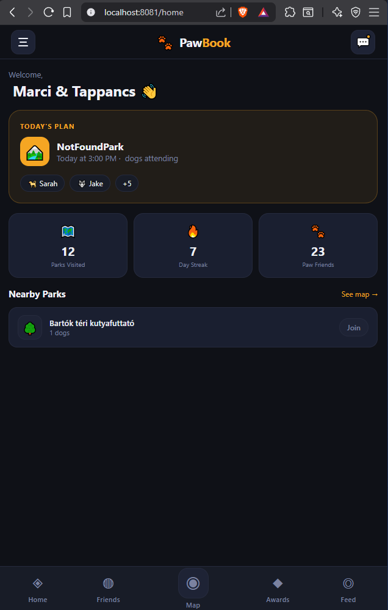
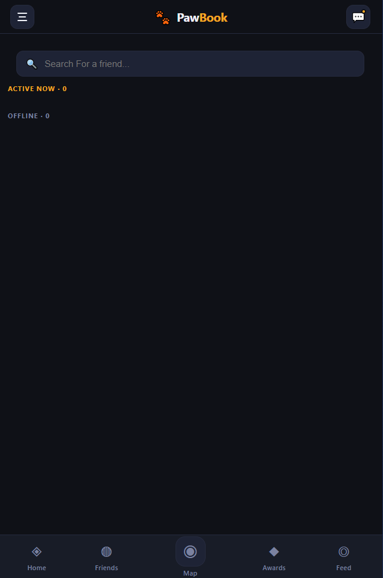
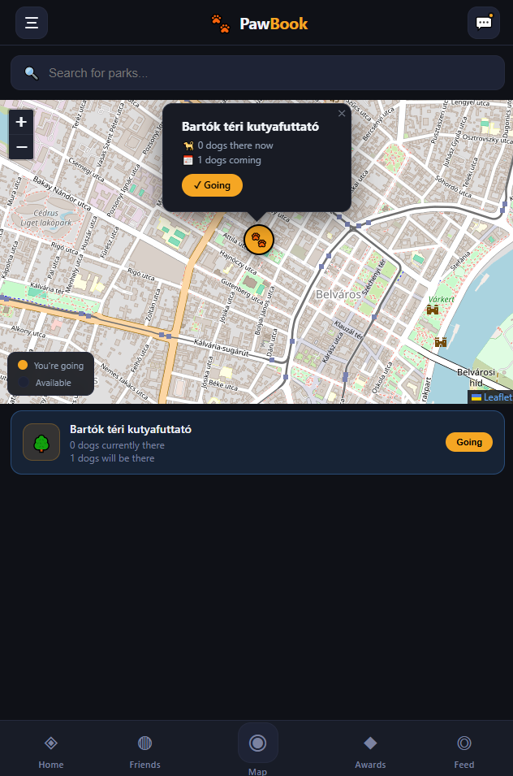
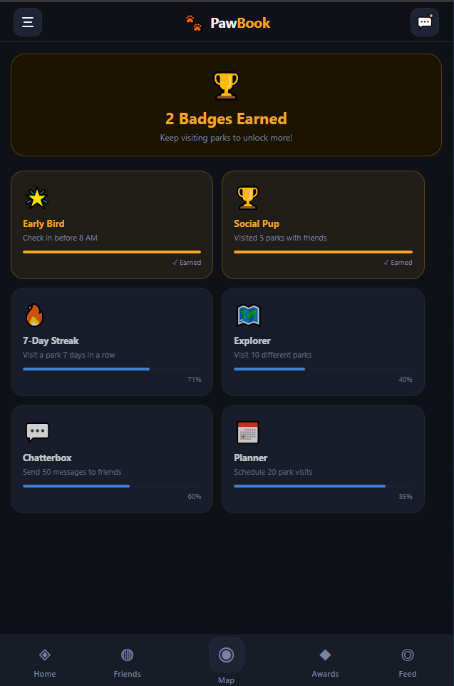
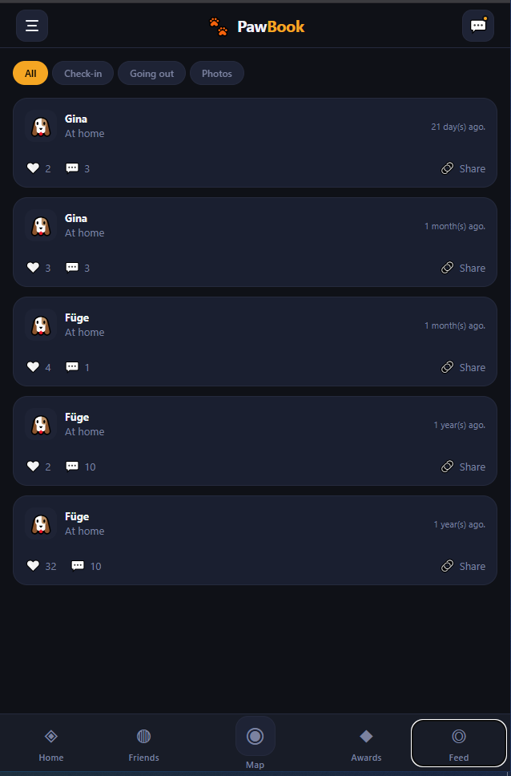
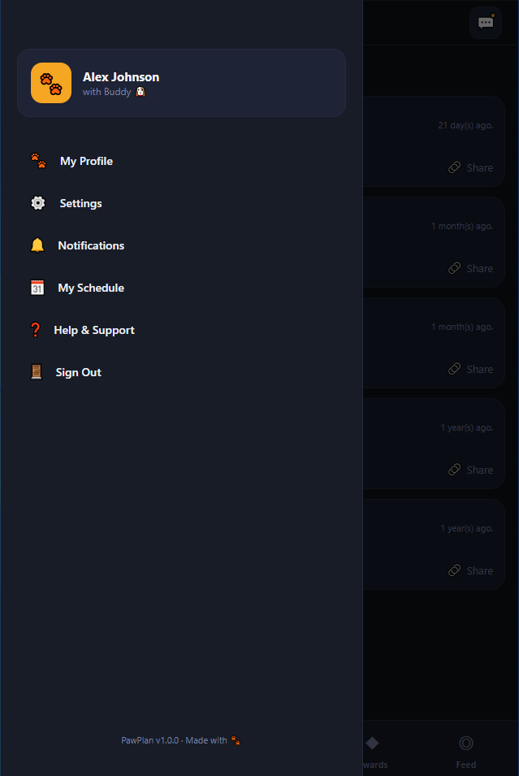

### Description:
- The goal of this project was to develop a practical, everyday-use application for a specific community.
- This Facebook-like mobile app is designed to help dog owners connect and engage more easily.
- Throughout development, I used AI to accelerate the workflow and gain experience on integrating this technology into a real-world project.

### Screenshots:

  
  
  
  
  
  

